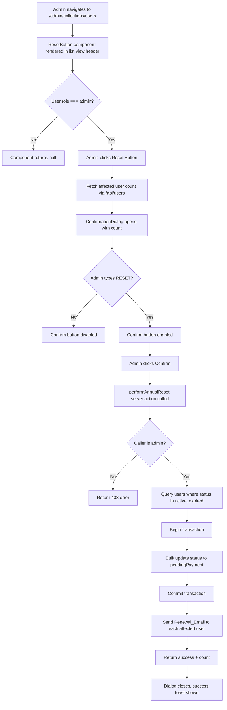

# Design Document — Annual Reset Button

## Overview

The Annual Reset Button is a custom admin UI feature for the Swim4Fun PayloadCMS admin panel. Each January, club administrators need to transition all `active` and `expired` members back to `pendingPayment` status to kick off the membership renewal cycle. This feature adds a clearly visible button to the Users collection list view, protected behind a two-step confirmation dialog, backed by a server action that performs the bulk update and sends renewal emails to all affected members.

The design follows the existing patterns in the codebase: a `'use client'` admin component registered via the `components` field in the collection config (mirroring `ValidateUser/ValidationControls`), a `'use server'` action in `src/actions/`, and a React Email template in `src/email/` sent via `sendEmail()`.

---

## Architecture



---

## Components and Interfaces

### 1. `ResetButton` — Admin UI Component

**Path:** `src/components/admin/AnnualReset/ResetButton.tsx`

A `'use client'` component registered as a custom field in the Users collection config. It renders in the list view header area using PayloadCMS's `admin.components.beforeListTable` slot.

Responsibilities:

- Read the current user's role from PayloadCMS's `useAuth()` hook and render nothing if not admin
- Fetch the count of `active`/`expired` users when the button is clicked (via the Payload REST API)
- Render the trigger button and own the `ConfirmationDialog` open state

```ts
// Registration in src/collections/Users/index.ts
admin: {
  components: {
    beforeListTable: ['src/components/admin/AnnualReset/ResetButton'],
  },
}
```

### 2. `ConfirmationDialog` — Dialog Component

**Path:** `src/components/admin/AnnualReset/ConfirmationDialog.tsx`

A `'use client'` dialog built with shadcn/ui `Dialog` + `AlertDialog` primitives (already available via Radix UI). Rendered inside `ResetButton`.

Props:

```ts
type ConfirmationDialogProps = {
  open: boolean
  onOpenChange: (open: boolean) => void
  affectedCount: number
  onConfirm: () => Promise<void>
  isLoading: boolean
}
```

Responsibilities:

- Display warning message with `affectedCount`
- Render a text input; track its value
- Enable the confirm button only when input value === `'RESET'`
- Show loading spinner on confirm button while `isLoading` is true
- Disable confirm button while loading

### 3. `performAnnualReset` — Server Action

**Path:** `src/actions/annualReset.ts`

```ts
'use server'

type ResetResult = {
  success: boolean
  message: string
  updatedCount?: number
}

export async function performAnnualReset(): Promise<ResetResult>
```

Responsibilities:

- Verify caller has `role === 'admin'` via `getMeUser()`; return 403-equivalent error if not
- Query `users` collection for all docs where `status in ['active', 'expired']`
- Begin a Payload transaction
- Bulk-update each affected user's `status` to `pendingPayment`
- Commit transaction; rollback on any DB error
- After successful commit, send `MembershipRenewalEmail` to each affected user (email failures are logged but do not roll back)
- Return `{ success: true, updatedCount }` or `{ success: false, message }`

### 4. `MembershipRenewalEmail` — Email Template

**Path:** `src/email/membershipRenewal.tsx`

```ts
type Args = {
  user: User
}
export async function MembershipRenewalEmail({ user }: Args): Promise<JSX.Element>
```

Uses `TemplateEmail` wrapper (same as `UserRegistration`). Informs the member their membership has entered the renewal period and directs them to the subscription page to complete payment.

---

## Data Models

No new collections or fields are required. The feature operates entirely on the existing `users` collection `status` field.

Relevant existing field:

```ts
// users collection — status field
{
  name: 'status',
  type: 'select',
  options: ['active', 'pendingAnalysis', 'pendingUpdate', 'pendingPayment', 'expired'],
}
```

The server action reads and writes only this field. The existing `afterChange` hook on the `users` collection already sends an email when `status` transitions to `pendingPayment` for individual updates — the annual reset action bypasses this hook by using `payload.db` bulk operations or by using `payload.update` per user (which will trigger the hook). To avoid double-emailing, the reset action must use a direct bulk update that skips hooks, then send the renewal email itself.

**Decision:** Use `payload.db.updateMany` (or iterate with `payload.update` passing `{ disableTransaction: true }` inside the manual transaction) with hooks disabled to avoid the existing `afterChange` email hook firing for each user. The reset action owns the email sending step explicitly.

Alternatively, since PayloadCMS v3's `payload.update` fires hooks by default, we use the lower-level `payload.db.updateMany` to bypass hooks, then send emails manually. This is the correct approach to avoid duplicate emails.

---

## Correctness Properties

_A property is a characteristic or behavior that should hold true across all valid executions of a system — essentially, a formal statement about what the system should do. Properties serve as the bridge between human-readable specifications and machine-verifiable correctness guarantees._

### Property 1: Non-admin role hides the Reset Button

_For any_ authenticated user whose `role` is not `admin` (i.e. `editor` or `default`), rendering the `ResetButton` component should produce no visible output.

**Validates: Requirements 1.3, 2.3**

---

### Property 2: Non-admin invocation is rejected without side effects

_For any_ invocation of `performAnnualReset` by a user whose `role` is not `admin`, the action should return a failure response (equivalent to HTTP 403) and zero user records in the `users` collection should have their `status` changed.

**Validates: Requirements 2.1, 2.2**

---

### Property 3: Affected user count is shown in the dialog

_For any_ number of users currently in `active` or `expired` status, the `ConfirmationDialog` should display exactly that count in its warning message.

**Validates: Requirements 3.1, 3.2**

---

### Property 4: Confirm button is enabled if and only if input matches the phrase

_For any_ string typed into the confirmation input, the confirm button should be enabled if and only if the string is exactly `'RESET'` (case-sensitive).

**Validates: Requirements 3.3, 3.4**

---

### Property 5: Reset correctly partitions users by status

_For any_ dataset of users with mixed statuses, after `performAnnualReset` completes successfully:

- Every user whose prior status was `active` or `expired` should have `status === 'pendingPayment'`
- Every user whose prior status was `pendingAnalysis`, `pendingUpdate`, or `pendingPayment` should have their status unchanged

**Validates: Requirements 4.2, 4.3**

---

### Property 6: Returned count equals the number of affected users

_For any_ dataset of users, the `updatedCount` value returned by `performAnnualReset` should equal the number of users whose status was `active` or `expired` before the call.

**Validates: Requirements 4.4**

---

### Property 7: Renewal email is sent to every affected user

_For any_ set of users with `active` or `expired` status, after a successful reset, `sendEmail` should have been called exactly once for each affected user's email address.

**Validates: Requirements 5.1**

---

### Property 8: Renewal email contains required content

_For any_ user, the rendered `MembershipRenewalEmail` template should contain the user's name and a reference to the subscription/payment page URL.

**Validates: Requirements 5.2**

---

### Property 9: Success notification shows the updated count

_For any_ successful `performAnnualReset` response containing an `updatedCount`, the `ResetButton` component should render a success notification that includes that count.

**Validates: Requirements 6.1**

---

### Property 10: Loading state disables the confirm button

_For any_ state where `isLoading` is `true`, the confirm button in `ConfirmationDialog` should be disabled regardless of the confirmation input value.

**Validates: Requirements 6.3**

---

## Error Handling

| Scenario                              | Behaviour                                                                                   |
| ------------------------------------- | ------------------------------------------------------------------------------------------- |
| Non-admin calls `performAnnualReset`  | Return `{ success: false, message: 'Forbidden' }`, no DB writes                             |
| DB transaction fails to begin         | Return `{ success: false, message: '...' }`, no writes                                      |
| DB error during bulk update           | Rollback transaction, return `{ success: false, message: '...' }`                           |
| Individual email send fails           | Log error via `payload.logger.error`, continue to next user, do not rollback status updates |
| Count fetch fails before dialog opens | Show error toast, do not open dialog                                                        |
| User closes dialog mid-flow           | Dialog closes, no action invoked, state reset                                               |

---

## Testing Strategy

### Unit Tests

Focus on specific examples and edge cases:

- `ResetButton` renders null for `editor` and `default` roles
- `ConfirmationDialog` confirm button is disabled on mount (empty input)
- `ConfirmationDialog` confirm button is disabled for near-matches like `'reset'`, `'RESET '`, `' RESET'`
- `ConfirmationDialog` confirm button is enabled for exactly `'RESET'`
- `performAnnualReset` returns 403-equivalent when called by non-admin
- `performAnnualReset` returns `updatedCount: 0` when no users are `active` or `expired`
- `MembershipRenewalEmail` renders without throwing for a minimal user object

### Property-Based Tests

Use **fast-check** (already compatible with the TypeScript/Node stack; install as `fast-check`).

Each property test runs a minimum of **100 iterations**.

Tag format: `Feature: annual-reset-button, Property {N}: {property_text}`

| Property | Test description                                                                                 |
| -------- | ------------------------------------------------------------------------------------------------ |
| P1       | Generate random non-admin roles; assert `ResetButton` renders null                               |
| P2       | Generate random non-admin user contexts; call action; assert failure + no DB mutation            |
| P3       | Generate arbitrary user counts; assert dialog renders the exact count                            |
| P4       | Generate arbitrary strings; assert button enabled iff string === `'RESET'`                       |
| P5       | Generate random user datasets with mixed statuses; run action; assert status partition invariant |
| P6       | Generate random user datasets; run action; assert `updatedCount` === prior active+expired count  |
| P7       | Generate random affected user sets; run action with mocked `sendEmail`; assert call count        |
| P8       | Generate random `User` objects; render template; assert name and subscription URL present        |
| P9       | Generate arbitrary `updatedCount` values in success response; assert notification contains count |
| P10      | Generate arbitrary input strings with `isLoading=true`; assert button always disabled            |

**Dual approach rationale:** Unit tests catch concrete regressions and edge cases (empty input, near-miss phrases, zero affected users). Property tests verify the general correctness invariants hold across the full input space, catching off-by-one errors, partial update bugs, and role-check bypasses that specific examples might miss.
